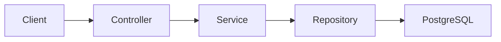

# Spring Boot Employee Management API — End-to-End Implementation Prompt

Copy this master prompt into GitHub Copilot, Claude Code, Cursor, Codex, or another AI coding assistant.

---

You are a senior Java and Spring Boot engineer. Build a complete, production-quality Employee Management REST API from scratch.

## Objective

Create an Employee Management application using:

- Java 17 or later
- Spring Boot 3.x
- Maven
- Spring Web
- Spring Data JPA
- PostgreSQL
- Jakarta Bean Validation
- Lombok, where appropriate
- Springdoc OpenAPI/Swagger
- JUnit 5
- Mockito
- H2 in-memory database for automated tests

The application must support complete employee CRUD operations and demonstrate a clean layered architecture suitable for a live Spring Boot workshop.

## Development approach

Follow these rules:

1. First inspect the existing repository, if one exists.
2. Do not overwrite working code without explaining why.
3. Present the implementation plan before modifying files.
4. Implement the application in small, verifiable steps.
5. Run compilation and tests after every major step.
6. Fix compilation, test, formatting, and configuration errors.
7. Do not leave TODOs, placeholder methods, or incomplete code.
8. Follow the existing project conventions when working inside an existing repository.
9. Explain any important design decision briefly.
10. At the end, provide the exact commands needed to run and test the application.

## Project details

Use the following defaults unless the repository already defines alternatives:

- Group: `com.javacodeex`
- Artifact: `employee-management-api`
- Base package: `com.javacodeex.employee`
- Application name: `employee-management-api`
- Default port: `8080`
- Base endpoint: `/api/v1/employees`
- PostgreSQL database: `employee_db`

## Required project structure

```text
com.javacodeex.employee
├── config
├── controller
├── dto
│   ├── request
│   └── response
├── entity
├── exception
├── mapper
├── repository
├── service
│   └── impl
└── EmployeeManagementApplication
```

Keep controllers, business logic, persistence models, DTOs, mapping, and exception handling clearly separated.

## Employee model

Create an `Employee` entity with:

- `id`: Long, generated primary key
- `employeeCode`: String, required and unique
- `firstName`: String, required
- `lastName`: String, required
- `email`: String, required, valid email, unique
- `phoneNumber`: String, optional
- `department`: String, required
- `jobTitle`: String, required
- `salary`: BigDecimal, required and greater than zero
- `active`: Boolean, default true
- `createdAt`: Instant or LocalDateTime
- `updatedAt`: Instant or LocalDateTime

Requirements:

- Use JPA annotations.
- Add database-level unique constraints for employee code and email.
- Automatically populate creation and update timestamps.
- Do not expose the entity directly through controller responses.
- Use `BigDecimal` for salary.
- Avoid leaking sensitive internal information in errors.

## DTOs

Create separate request and response DTOs.

### CreateEmployeeRequest

Include all employee fields required for creation except:

- ID
- Creation timestamp
- Update timestamp

Apply validation annotations with helpful messages.

### UpdateEmployeeRequest

Include fields that users can update. Implement PUT as a complete update and document the expected behavior.

### EmployeeResponse

Return:

- ID
- Employee code
- First and last names
- Email
- Phone number
- Department
- Job title
- Salary
- Active status
- Creation timestamp
- Update timestamp

Use a dedicated mapper to convert between DTOs and entities. Do not perform repetitive mapping inside controllers.

## REST endpoints

### Create employee

```http
POST /api/v1/employees
```

- Validate the request.
- Reject duplicate employee code and email.
- Return `201 Created`.
- Include the created employee.
- Add a `Location` header pointing to the new resource.

### Retrieve all employees

```http
GET /api/v1/employees
```

- Support pagination and sorting.
- Default page: `0`
- Default size: `10`
- Default sort: `id,asc`
- Return pagination metadata.

### Retrieve employee by ID

```http
GET /api/v1/employees/{id}
```

- Return `200 OK` when found.
- Return `404 Not Found` when missing.

### Update employee

```http
PUT /api/v1/employees/{id}
```

- Validate the complete request.
- Check email and employee-code uniqueness.
- Allow the employee’s existing email and code.
- Return `200 OK`.
- Return `404 Not Found` when missing.

### Delete employee

```http
DELETE /api/v1/employees/{id}
```

- Delete the employee.
- Return `204 No Content`.
- Return `404 Not Found` when missing.

### Filtering

Support useful query parameters:

```http
GET /api/v1/employees?department=Engineering
GET /api/v1/employees?active=true
GET /api/v1/employees?name=Anand
```

Implement filters cleanly without duplicating controller logic.

## Repository layer

Create `EmployeeRepository` extending `JpaRepository<Employee, Long>`.

Include only methods required by the implementation, such as:

```java
boolean existsByEmployeeCode(String employeeCode);

boolean existsByEmailIgnoreCase(String email);

Optional<Employee> findByEmployeeCode(String employeeCode);
```

## Service layer

Create an `EmployeeService` interface and implementation.

The service must:

- Contain business logic.
- Use constructor injection.
- Map requests to entities.
- Handle duplicate email and employee code.
- Throw domain-specific exceptions.
- Use appropriate `@Transactional` boundaries.
- Use read-only transactions for retrieval methods where appropriate.
- Avoid returning JPA entities to the controller.

Do not use field injection.

## Exception handling

Create:

- `EmployeeNotFoundException`
- `DuplicateEmployeeCodeException`
- `DuplicateEmailException`

Create a global handler using `@RestControllerAdvice`.

Return a consistent error response containing:

- Timestamp
- HTTP status
- Error name
- Human-readable message
- Request path
- Validation errors, when applicable
- Correlation or trace ID, if available

Handle:

- Resource not found
- Duplicate values
- Bean validation failures
- Malformed JSON
- Invalid request parameters
- Type mismatch
- Unexpected server errors

Do not return Java stack traces or database details to clients.

## PostgreSQL and Flyway

Configure PostgreSQL using:

```text
DB_HOST
DB_PORT
DB_NAME
DB_USERNAME
DB_PASSWORD
```

Provide safe local defaults where appropriate.

Create:

- `application.yml`
- `application-local.yml`
- `application-test.yml`

Do not hard-code production passwords.

Use Flyway migrations instead of Hibernate schema generation. Create:

```text
src/main/resources/db/migration/V1__create_employees_table.sql
```

Configure Hibernate to validate the schema.

## Swagger/OpenAPI

Configure Springdoc with:

- Title: `Employee Management API`
- Description: `Employee CRUD API built during the Java Codeex Spring Boot and AI workshop`
- Version: `v1`

Add summaries and response descriptions to controller operations. Document validation and standard error responses.

Expected local URL:

```text
http://localhost:8080/swagger-ui/index.html
```

## Logging and correlation ID

- Use SLF4J.
- Log important operations without exposing sensitive information.
- Add or propagate a correlation ID using an HTTP filter.
- Return it in a response header.
- Include it in application logs.
- Do not log passwords, salary payloads, or complete personal information.

## Unit tests

Use JUnit 5 and Mockito to test:

- Successful employee creation
- Duplicate employee code
- Duplicate email
- Retrieve employee by ID
- Employee not found
- Successful update
- Update missing employee
- Successful deletion
- Delete missing employee
- Pagination and mapping

Use Arrange–Act–Assert.

## Controller tests

Use MockMvc to test:

- Successful creation
- Invalid creation request
- Retrieve employee
- Employee not found
- Successful update
- Successful deletion
- HTTP status codes
- Validation-error structure
- Content type and important response fields

## Integration tests

Use `@SpringBootTest`, MockMvc, and an H2 in-memory database configured through the test profile.

Test this full flow:

1. Start the Spring test application context.
2. Initialize the test schema.
3. Create an employee through the REST API.
4. Retrieve it.
5. Update it.
6. Retrieve all employees.
7. Delete it.
8. Verify the deleted ID returns `404`.

The automated tests must not require a running PostgreSQL instance. Configure H2 in PostgreSQL compatibility mode where practical. Keep the production and local profiles configured for PostgreSQL.

## Sample API requests

Provide a `requests.http` file or Postman collection covering:

- Create
- Retrieve all
- Retrieve by ID
- Update
- Delete
- Invalid request
- Duplicate email
- Employee not found

Example:

```json
{
  "employeeCode": "EMP-1001",
  "firstName": "Anand",
  "lastName": "Jangali",
  "email": "anand@example.com",
  "phoneNumber": "9876543210",
  "department": "Engineering",
  "jobTitle": "Senior Java Developer",
  "salary": 150000.00,
  "active": true
}
```

## README

Create a complete `README.md` covering:

1. Project overview
2. Architecture
3. Technology stack
4. Prerequisites
5. Project structure
6. Environment variables
7. Local PostgreSQL setup
8. Maven commands
9. API endpoint table
10. Sample requests and responses
11. Swagger URL
12. Testing instructions
13. Common errors and troubleshooting
14. AI coding-assistant examples
15. Future improvements

Include:



## Quality requirements

Ensure:

- The project compiles.
- All tests pass.
- There are no unused imports or dead code.
- Validation messages are understandable.
- HTTP statuses are correct.
- Controllers remain thin.
- Business logic stays in services.
- Database access stays in repositories.
- Entities are not exposed directly.
- Transactions are correct.
- Exceptions return consistent responses.
- No credentials are committed.
- Modern Spring Boot 3 and Jakarta APIs are used.

## Implementation stages

### Stage 1: Bootstrap

- Generate or validate the Maven project.
- Add dependencies and configuration.
- Confirm the application starts.

### Stage 2: Domain and database

- Create the entity.
- Add Flyway migration.
- Create the repository.
- Verify connectivity.

### Stage 3: API implementation

- Create DTOs and mapper.
- Implement service and controller.
- Add exception handling and validation.

### Stage 4: Documentation and observability

- Add Swagger.
- Add correlation ID handling.
- Add logging and sample requests.

### Stage 5: Testing

- Add unit, controller, and H2-backed integration tests.
- Run the complete test suite.

### Stage 6: Final validation

Run:

```bash
./mvnw clean verify
./mvnw spring-boot:run -Dspring-boot.run.profiles=local
```

Verify:

- Application health
- Swagger UI
- Create, retrieve, update, and delete
- Missing employee returns `404`
- Invalid request returns `400`
- Duplicate email returns `409`

## Final response format

After implementation, provide:

1. Summary of what was created
2. Important design decisions
3. Files created or modified
4. Build and test results
5. API URLs
6. Commands to start the application
7. Sample curl commands
8. Assumptions
9. Recommended improvements

Do not stop after generating code. Compile, test, diagnose failures, correct them, and deliver a runnable end-to-end application.
